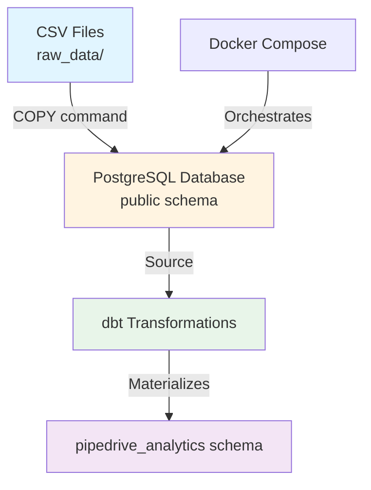
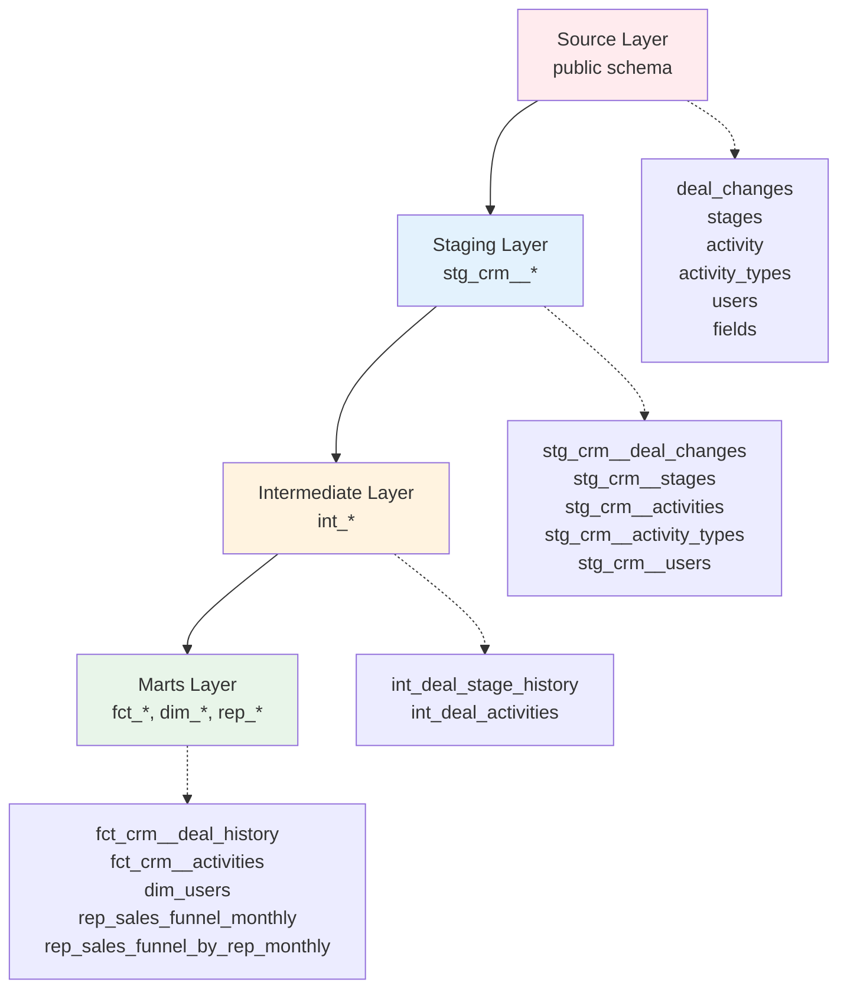
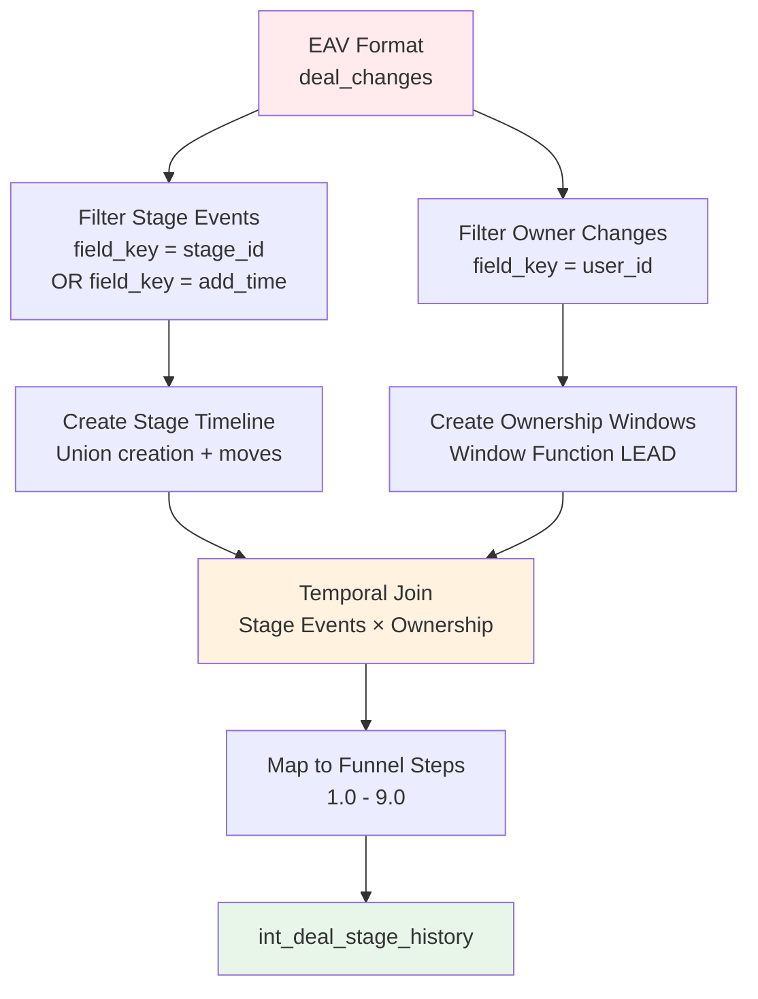
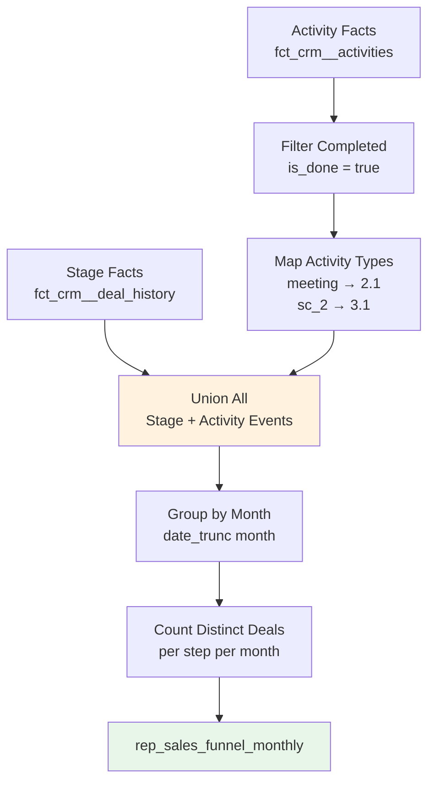

# Pipedrive CRM Data Pipeline Documentation

## Table of Contents
1. [Executive Summary](#executive-summary)
2. [Raw Data Sources](#raw-data-sources)
3. [Data Loading Process](#data-loading-process)
4. [Data Architecture & dbt Layers](#data-architecture--dbt-layers)
5. [Key Business Logic & Transformations](#key-business-logic--transformations)
6. [Data Flow Diagrams](#data-flow-diagrams)
7. [Funnel Step Mapping](#funnel-step-mapping)
8. [Data Insights & Observations](#data-insights--observations)
9. [Model Dependencies](#model-dependencies)
10. [Usage Instructions](#usage-instructions)

---

## Executive Summary

### Project Overview
This project transforms raw Pipedrive CRM export data into actionable sales funnel analytics. The data pipeline extracts, transforms, and loads (ETL) CRM data through a multi-layer architecture using dbt (data build tool), ultimately producing monthly sales funnel reports that track deal progression through a 9-step sales process.

### Data Source
- **Source System**: Pipedrive CRM
- **Export Format**: CSV files containing deal changes, activities, users, stages, and metadata
- **Data Model**: Event-driven architecture using Entity-Attribute-Value (EAV) pattern for deal changes

### Key Deliverables
- **Primary Model**: `rep_sales_funnel_monthly` - Monthly aggregated sales funnel metrics
- **Secondary Model**: `rep_sales_funnel_by_rep_monthly` - Sales funnel broken down by sales representative
- **Supporting Models**: Fact and dimension tables for comprehensive CRM analytics

### Technology Stack
- **Database**: PostgreSQL (via Docker)
- **Transformation Tool**: dbt (data build tool)
- **Infrastructure**: Docker Compose
- **Output Schema**: `pipedrive_analytics`

---

## Raw Data Sources

The project processes 6 CSV files exported from Pipedrive CRM. Each file represents a different aspect of the CRM data model.

### 1. deal_changes.csv

**Purpose**: Tracks all changes made to deals in an EAV (Entity-Attribute-Value) format. This table maintains a complete audit trail of deal modifications.

**Schema** (from `init.sql`):
```sql
CREATE TABLE deal_changes (
    deal_id INT,
    change_time TIMESTAMP,
    changed_field_key VARCHAR(50),
    new_value VARCHAR(255)
);
```

**Key Characteristics**:
- **Format**: EAV pattern - each row represents one field change
- **No Primary Key**: Requires surrogate key generation in staging layer
- **Fields Tracked**: `stage_id`, `user_id`, `add_time`, `lost_reason`
- **Business Context**: Captures the complete history of deal progression, ownership changes, and status updates

**Data Quality Considerations**:
- Multiple rows per deal (one per field change)
- Timestamps may not be sequential if data is imported
- `new_value` stored as VARCHAR (requires type casting)
- No deletion tracking (only additions/modifications)

**Relationships**:
- Links to `stages` via `changed_field_key = 'stage_id'` and `new_value = stage_id`
- Links to `users` via `changed_field_key = 'user_id'` and `new_value = user_id`
- Each deal_id can have multiple change events

---

### 2. stages.csv

**Purpose**: Lookup table that maps stage IDs to readable stage names. Defines the sales pipeline structure.

**Schema**:
```sql
CREATE TABLE stages (
    stage_id INT PRIMARY KEY,
    stage_name VARCHAR(255)
);
```

**Key Characteristics**:
- **Format**: Simple lookup/dimension table
- **Primary Key**: `stage_id` (1-9 for main funnel steps)
- **Business Context**: Represents the 9 stages of the sales funnel

**Data Quality Considerations**:
- Relatively static data (rarely changes)
- Stage IDs should be sequential (1-9)
- Stage names should be descriptive and consistent

**Relationships**:
- Referenced by `deal_changes` when `changed_field_key = 'stage_id'`
- Used to enrich deal history with stage names

---

### 3. activity.csv

**Purpose**: Records sales activities (calls, meetings, emails) associated with deals. Tracks what actions sales reps take to move deals forward.

**Schema**:
```sql
CREATE TABLE activity (
    activity_id INT,
    type VARCHAR(50),
    assigned_to_user INT,
    deal_id INT,
    done BOOLEAN,
    due_to TIMESTAMP
);
```

**Key Characteristics**:
- **Activity Types**: Identified by `type` field (e.g., 'meeting', 'sc_2')
- **Completion Status**: `done` boolean indicates if activity was completed
- **Timing**: `due_to` timestamp indicates when activity was scheduled/completed
- **Business Context**: Activities represent key touchpoints in the sales process (e.g., Sales Call 1, Sales Call 2)

**Data Quality Considerations**:
- `type` is a code/key (not readable) - requires join to `activity_types`
- `due_to` may be NULL for incomplete activities
- `done` status indicates completion but doesn't guarantee data quality
- One activity can be assigned to one user and linked to one deal

**Relationships**:
- Links to `activity_types` via `type = activity_type_key`
- Links to `users` via `assigned_to_user = user_id`
- Links to deals via `deal_id` (though deals table not explicitly provided)

---

### 4. activity_types.csv

**Purpose**: Lookup table that translates activity type codes to readable names. Provides metadata about activity types.

**Schema**:
```sql
CREATE TABLE activity_types (
    id INT PRIMARY KEY,
    name VARCHAR(255),
    active VARCHAR(10),
    type VARCHAR(50)
);
```

**Key Characteristics**:
- **Format**: Lookup/dimension table
- **Type Codes**: Stored in `type` field (e.g., 'meeting', 'sc_2')
- **Human Names**: Stored in `name` field (e.g., 'Sales Call 2')
- **Business Context**: Maps technical activity codes to business-friendly names

**Data Quality Considerations**:
- Relatively static data
- `active` field may indicate deprecated types
- Type codes should be unique and consistent

**Relationships**:
- Referenced by `activity` table via `type = activity_type_key`
- Enables human-readable activity reporting

---

### 5. users.csv

**Purpose**: Stores information about sales representatives/users in the CRM system.

**Schema**:
```sql
CREATE TABLE users (
    id INT PRIMARY KEY,
    name VARCHAR(255),
    email VARCHAR(255),
    modified TIMESTAMP
);
```

**Key Characteristics**:
- **Format**: Dimension table
- **Primary Key**: `id` (user_id)
- **Business Context**: Identifies sales reps responsible for deals and activities

**Data Quality Considerations**:
- User IDs should be unique
- Email addresses should be valid (though not enforced)
- `modified` timestamp tracks last update
- No explicit active/inactive flag (all users assumed active)

**Relationships**:
- Referenced by `deal_changes` when tracking ownership (`changed_field_key = 'user_id'`)
- Referenced by `activity` via `assigned_to_user`
- Used to identify rep performance in reporting

---

### 6. fields.csv (Optional Reference)

**Purpose**: Metadata table that describes field keys and their possible values. Primarily used for reference when interpreting `deal_changes`.

**Schema**:
```sql
CREATE TABLE fields (
    ID INT PRIMARY KEY,
    FIELD_KEY VARCHAR(50),
    NAME VARCHAR(255),
    FIELD_VALUE_OPTIONS JSONB
);
```

**Key Characteristics**:
- **Format**: Metadata/reference table
- **JSONB Field**: `FIELD_VALUE_OPTIONS` may contain enumeration values
- **Business Context**: Provides context for interpreting field keys in `deal_changes`

**Data Quality Considerations**:
- Not actively used in current transformations
- May be useful for data exploration and validation
- JSONB format allows flexible value options

---

## Data Loading Process

### Infrastructure Setup

The data loading process uses Docker Compose to orchestrate PostgreSQL database initialization and CSV data import.

#### Docker Compose Configuration

The `docker-compose.yml` defines two services:

1. **Database Service (`db`)**:
   - PostgreSQL latest image
   - Creates database on startup via `init.sql`
   - Mounts `raw_data` directory for CSV access
   - Exposes port 5432

2. **Data Loader Service (`data_loader`)**:
   - Executes data loading script after database is ready
   - Uses same PostgreSQL image (for `psql` client)
   - Depends on `db` service

**Database Credentials**:
- Host: `localhost` (from host machine)
- Port: `5432`
- Database: `postgres`
- User: `admin`
- Password: `admin`

#### Database Initialization

The `init.sql` script runs automatically when the PostgreSQL container starts (via `/docker-entrypoint-initdb.d/`):

1. Creates all 6 tables with appropriate schemas
2. Defines primary keys where applicable
3. Sets appropriate data types (INT, VARCHAR, TIMESTAMP, BOOLEAN, JSONB)

#### Data Loading Script

The `raw_data/load_data.sh` script performs the CSV import:

```bash
#!/bin/bash

# Wait until PostgreSQL is ready
until pg_isready -h db -U admin; do
  echo "Waiting for database connection..."
  sleep 2
done

# Load each CSV file into its corresponding table
for file in /raw_data/*.csv; do
  table_name=$(basename "$file" .csv)
  echo "Loading data from $file into table $table_name..."
  psql -h db -U admin -d postgres -c "\COPY $table_name FROM '$file' DELIMITER ',' CSV HEADER;"
done

echo "Data loading completed."
```

**Process Flow**:
1. Script waits for PostgreSQL to be ready (health check)
2. Iterates through all CSV files in `/raw_data/`
3. Uses PostgreSQL `COPY` command for efficient bulk loading
4. Assumes CSV files have headers (HEADER option)
5. Uses comma delimiter

**Execution Flow**:
```
Docker Compose Start
    ↓
PostgreSQL Container Starts
    ↓
init.sql Executes (Creates Tables)
    ↓
Data Loader Container Starts
    ↓
load_data.sh Executes
    ↓
CSV Files Loaded into Tables
    ↓
Database Ready for dbt Processing
```

---

## Data Architecture & dbt Layers

The dbt project follows a layered architecture pattern, transforming data through multiple stages to ensure data quality, maintainability, and business logic separation.

### 4.1 Source Definition

**File**: `models/staging/crm/src_crm.yml`

The source definition connects dbt to the raw PostgreSQL tables:

```yaml
sources:
  - name: crm
    description: "Raw Pipedrive export data"
    database: postgres
    schema: public
    loader: "Custom Shell Script"
    tables:
      - name: deal_changes
        loaded_at_field: change_time
        freshness:
          warn_after: {count: 24, period: hour}
          error_after: {count: 48, period: hour}
      - name: stages
      - name: fields
      - name: activity
      - name: activity_types
      - name: users
```

**Key Features**:
- **Source Name**: `crm` - referenced in staging models as `{{ source('crm', 'table_name') }}`
- **Freshness Checks**: Configured for `deal_changes` table to monitor data staleness
- **Documentation**: Each table includes description for dbt docs

### 4.2 Staging Layer

**Location**: `models/staging/crm/`

The staging layer performs initial data cleaning, type casting, and standardization. All staging models follow the naming convention `stg_crm__{table_name}.sql`.

#### stg_crm__deal_changes.sql

**Purpose**: Clean and standardize deal changes data, creating surrogate keys.

**Key Transformations**:
- **Surrogate Key Generation**: Creates `change_id` using `dbt_utils.generate_surrogate_key()` (no natural primary key exists)
- **Type Casting**: 
  - `deal_id` → INTEGER
  - `change_time` → TIMESTAMP (renamed to `occurred_at`)
  - `changed_field_key` → VARCHAR (renamed to `field_key`)
  - `new_value` → VARCHAR
- **Column Renaming**: Standardizes names (e.g., `change_time` → `occurred_at`)

```sql
select
    {{ dbt_utils.generate_surrogate_key(['deal_id', 'change_time', 'changed_field_key', 'new_value']) }} as change_id,
    cast(deal_id as integer) as deal_id,
    cast(change_time as timestamp) as occurred_at,
    cast(changed_field_key as varchar) as field_key,
    cast(new_value as varchar) as new_value
from {{ source('crm', 'deal_changes') }}
```

#### stg_crm__activities.sql

**Purpose**: Standardize activity data with proper types and naming.

**Key Transformations**:
- **Type Casting**: All IDs and flags properly cast
- **Boolean Standardization**: `done` → `is_done` (boolean)
- **Timestamp Standardization**: `due_to` → `due_at` (timestamp)
- **Column Renaming**: Standardizes field names (`assigned_to_user` → `user_id`)

```sql
select
    cast(activity_id as integer) as activity_id,
    cast(deal_id as integer) as deal_id,
    cast(assigned_to_user as integer) as user_id,
    cast(type as varchar) as activity_type,
    cast(done as boolean) as is_done,
    cast(due_to as timestamp) as due_at
from {{ source('crm', 'activity') }}
```

#### stg_crm__stages.sql

**Purpose**: Standardize stage lookup data.

**Key Transformations**:
- Type casting for `stage_id` and `stage_name`
- Adds `stage_order` (same as `stage_id`) for sorting

#### stg_crm__users.sql

**Purpose**: Standardize user dimension data.

**Key Transformations**:
- `id` → `user_id`
- `name` → `user_name`
- `modified` → `updated_at`
- All fields properly cast

#### stg_crm__activity_types.sql

**Purpose**: Standardize activity type lookup data.

**Key Transformations**:
- `id` → `activity_type_id`
- `type` → `activity_type_key` (e.g., 'sc_2')
- `name` → `activity_type_name` (e.g., 'Sales Call 2')
- `active` → `is_active` (boolean)

**Staging Layer Purpose**: 
- Ensures data type consistency
- Standardizes naming conventions
- Creates surrogate keys where needed
- Provides clean base for downstream transformations

### 4.3 Intermediate Layer

**Location**: `models/intermediate/`

The intermediate layer applies business logic and creates reusable transformations. These models are not directly queried by end users but serve as building blocks for marts.

#### int_deal_stage_history.sql

**Purpose**: Reconstruct deal stage progression timeline from EAV format and track historical ownership.

**Complex Business Logic**:

1. **Deal Ownership History**:
   - Extracts `user_id` changes from `deal_changes`
   - Creates temporal validity windows using window functions
   - Each ownership period has `valid_from` and `valid_to` timestamps
   - Uses `LEAD()` window function to determine when ownership ends

```sql
owner_history as (
    select
        deal_id,
        cast(new_value as integer) as owner_user_id,
        occurred_at as valid_from,
        lead(occurred_at, 1, '9999-12-31') over (
            partition by deal_id 
            order by occurred_at
        ) as valid_to
    from changes
    where field_key = 'user_id'
)
```

2. **Stage Event Reconstruction**:
   - **Deal Creation**: Uses `field_key = 'add_time'` to identify when deals were created (mapped to stage 1)
   - **Stage Moves**: Uses `field_key = 'stage_id'` to track stage transitions
   - Combines creation and moves into unified event stream

```sql
stage_events as (
    -- Creation (Funnel Step 1)
    select deal_id, occurred_at as valid_from, 1 as stage_id
    from changes 
    where field_key = 'add_time'
    
    union all
    
    -- Moves
    select deal_id, occurred_at as valid_from, cast(new_value as integer) as stage_id
    from changes 
    where field_key = 'stage_id'
)
```

3. **Funnel Step Mapping**:
   - Maps stage IDs (1-9) to funnel step numbers (1.0-9.0)
   - Each stage corresponds to a funnel step

4. **Temporal Join for Ownership**:
   - Joins stage events to ownership history
   - Ensures correct rep is assigned based on who owned the deal at the time of the event
   - Uses range join: `valid_from >= o.valid_from AND valid_from < o.valid_to`

**Output Columns**:
- `deal_id`: Deal identifier
- `valid_from`: When the stage event occurred
- `rep_name`: Sales rep who owned the deal at that time
- `funnel_step_number`: Numeric funnel step (1.0-9.0)
- `kpi_name`: Human-readable stage name

#### int_deal_activities.sql

**Purpose**: Enrich activities with type names and user information.

**Key Transformations**:
1. **Activity Type Resolution**: Joins to `stg_crm__activity_types` to get human-readable names
2. **User Enrichment**: Joins to `stg_crm__users` to get rep names
3. **Funnel Mapping Category**: Creates categorization logic (though doesn't filter)
   - 'meeting' → 'Funnel Step 2.1'
   - 'sc_2' → 'Funnel Step 3.1'
   - Others → 'Other'

**Output Columns**:
- `deal_id`, `activity_id`
- `activity_at`: When activity occurred
- `is_done`: Completion status
- `user_id`, `rep_name`
- `activity_type_key`, `activity_type_name`
- `funnel_mapping_category`

**Design Philosophy**: This intermediate model doesn't filter activities, making it reusable for multiple reporting needs.

### 4.4 Marts Layer

**Location**: `models/marts/`

The marts layer contains final business models optimized for analytics and reporting. Models are materialized as tables for performance.

#### fct_crm__deal_history.sql

**Purpose**: Incremental fact table tracking deal stage transitions over time.

**Configuration**:
```sql
{{ config(
    materialized='incremental',
    unique_key=['deal_id', 'valid_from']
) }}
```

**Key Features**:
- **Incremental Materialization**: Only processes new records on subsequent runs
- **Unique Key**: Combination of `deal_id` and `valid_from` ensures no duplicates
- **Incremental Logic**: Filters to records where `valid_from >= max(valid_from)` from existing table

**Output Columns**:
- `deal_id`: Deal identifier
- `valid_from`: Stage transition timestamp
- `funnel_step_number`: Funnel step (1.0-9.0)
- `stage_name`: Human-readable stage name
- `historical_owner_name`: Rep who owned deal at that time

**Use Case**: Provides historical timeline of all deal stage transitions for time-series analysis.

#### fct_crm__activities.sql

**Purpose**: Incremental fact table for sales activities.

**Configuration**:
```sql
{{ config(
    materialized='incremental',
    unique_key='activity_id'
) }}
```

**Key Features**:
- **Incremental Materialization**: Efficient for large activity volumes
- **Activity Details**: Includes type, deal association, user, completion status
- **KPI Names**: Human-readable activity type names

**Output Columns**:
- `activity_id`: Primary key
- `deal_id`: Associated deal
- `user_id`: Assigned user
- `activity_type`: Type code (e.g., 'sc_2')
- `kpi_name`: Human name (e.g., 'Sales Call 2')
- `is_done`: Completion status
- `activity_at`: Timestamp

#### dim_users.sql

**Purpose**: User dimension table for reporting.

**Key Features**:
- Simple dimension with user details
- Includes `is_active` flag (defaults to true)
- Cleaned user names and emails

#### rep_sales_funnel_monthly.sql (PRIMARY DELIVERABLE)

**Purpose**: Monthly aggregated sales funnel report tracking unique deals entering each funnel step.

**Business Logic**:

1. **Stage Facts**: Extracts stage transitions from `fct_crm__deal_history`
   - Uses `stage_name` as `kpi_name`
   - Uses `funnel_step_number` as `funnel_step`

2. **Activity Facts**: Extracts relevant activities from `fct_crm__activities`
   - Filters to completed activities (`is_done = true`)
   - Maps activities to funnel steps:
     - 'meeting' → 2.1 (Sales Call 1)
     - 'sc_2' → 3.1 (Sales Call 2)
   - Uses `kpi_name` from activities table

3. **Union**: Combines stage events and activity events
   - Both contribute to funnel metrics
   - Activities provide additional granularity at steps 2.1 and 3.1

4. **Monthly Aggregation**:
   - Groups by month (using `date_trunc('month', valid_from)`)
   - Counts distinct deals per funnel step
   - Formats month as 'YYYY-MM'

**Output Schema**:
| Column | Type | Description |
|--------|------|-------------|
| `month` | VARCHAR | Reporting month (YYYY-MM format) |
| `kpi_name` | VARCHAR | Name of funnel stage/activity |
| `funnel_step` | NUMERIC | Funnel step number (1.0, 2.0, 2.1, 3.0, 3.1, 4.0-9.0) |
| `deals_count` | INTEGER | Count of unique deals entering this step in the month |

**Example Output**:
```
month    | kpi_name          | funnel_step | deals_count
---------|-------------------|-------------|------------
2024-01  | Lead Generation   | 1.0         | 150
2024-01  | Qualified Lead    | 2.0         | 120
2024-01  | Meeting           | 2.1         | 95
2024-01  | Needs Assessment  | 3.0         | 80
...
```

#### rep_sales_funnel_by_rep_monthly.sql

**Purpose**: Sales funnel report broken down by sales representative.

**Key Differences from Monthly Report**:
- Adds `rep_name` dimension
- Groups by month, rep, funnel step
- Enables rep-level performance analysis
- Uses `coalesce(rep_name, 'Unassigned')` for deals without assigned reps

---

## Key Business Logic & Transformations

### 5.1 Deal Stage History Logic

#### EAV to Timeline Conversion

The `deal_changes` table uses an EAV (Entity-Attribute-Value) pattern, where each row represents one field change. This structure is efficient for storage but requires transformation for analytics.

**Challenge**: Convert multiple rows per deal into a chronological timeline.

**Solution**: 
1. Filter to stage-related events (`field_key = 'stage_id'` or `field_key = 'add_time'`)
2. Union creation events (mapped to stage 1) with stage change events
3. Order by timestamp to create timeline

#### Stage Event Detection

Two types of events indicate stage progression:

1. **Deal Creation** (`field_key = 'add_time'`):
   - Represents initial entry into pipeline
   - Always mapped to stage 1 (Lead Generation)
   - Uses `change_time` as event timestamp

2. **Stage Changes** (`field_key = 'stage_id'`):
   - Represents progression through pipeline
   - `new_value` contains target stage_id
   - Multiple events per deal (one per stage transition)

#### Temporal Ownership Tracking

**Challenge**: Deals can change ownership over time. When analyzing historical stage transitions, we need to know which rep owned the deal at each point in time.

**Solution**: Window function-based temporal validity tracking:

```sql
-- Create ownership periods
owner_history as (
    select
        deal_id,
        owner_user_id,
        valid_from,
        -- Next ownership change, or '9999-12-31' if current
        lead(occurred_at, 1, '9999-12-31') over (
            partition by deal_id 
            order by occurred_at
        ) as valid_to
    from user_id_changes
)

-- Join stage events to ownership using temporal range
left join owner_history o 
    on e.deal_id = o.deal_id 
    and e.valid_from >= o.valid_from 
    and e.valid_from < o.valid_to
```

**How It Works**:
- Each ownership change creates a validity period
- `LEAD()` function identifies when the next change occurs
- Range join ensures stage events are matched to the correct owner period
- Default end date ('9999-12-31') handles current ownership

#### Funnel Step Mapping

Stage IDs are mapped to numeric funnel steps for consistent reporting:

| Stage ID | Funnel Step | Stage Name |
|----------|-------------|------------|
| 1 | 1.0 | Lead Generation |
| 2 | 2.0 | Qualified Lead |
| 3 | 3.0 | Needs Assessment |
| 4 | 4.0 | Proposal/Quote Preparation |
| 5 | 5.0 | Negotiation |
| 6 | 6.0 | Closing |
| 7 | 7.0 | Implementation/Onboarding |
| 8 | 8.0 | Follow-up/Customer Success |
| 9 | 9.0 | Renewal/Expansion |

**Implementation**: Simple CASE statement in `int_deal_stage_history.sql`

### 5.2 Activity Logic

#### Activity Type Resolution

Activities use type codes (e.g., 'meeting', 'sc_2') that require translation to human-readable names.

**Solution**: Join to `activity_types` lookup table:
- `type` (from activity) → `activity_type_key` (from activity_types)
- Retrieves `activity_type_name` for reporting

#### Funnel Step Mapping for Activities

Certain activities map to specific funnel steps, providing granularity beyond stage transitions:

| Activity Type | Funnel Step | Description |
|---------------|-------------|-------------|
| 'meeting' | 2.1 | Sales Call 1 (within Qualified Lead stage) |
| 'sc_2' | 3.1 | Sales Call 2 (within Needs Assessment stage) |

**Business Logic**:
- Activities enrich stage-based funnel with activity-based metrics
- Only completed activities (`is_done = true`) count toward funnel
- Activity steps (2.1, 3.1) are sub-steps within their parent stages (2.0, 3.0)

#### Completion Status Filtering

Only completed activities contribute to funnel metrics:
- `is_done = true` filter applied in reporting models
- Incomplete activities are excluded from counts
- Ensures metrics reflect actual progress, not just planned activities

### 5.3 Sales Funnel Construction

#### Union of Events

The final funnel combines two event types:

1. **Stage Events**: From `fct_crm__deal_history`
   - Represent deal progression through stages
   - Contribute steps 1.0-9.0

2. **Activity Events**: From `fct_crm__activities`
   - Represent key activities within stages
   - Contribute steps 2.1 and 3.1

**Union Logic**:
```sql
unioned as (
    select deal_id, valid_from, kpi_name, funnel_step from stage_facts
    union all
    select deal_id, activity_at as valid_from, kpi_name, funnel_step from activity_facts
)
```

**Why Union All**: 
- Allows same deal to appear multiple times (different steps)
- Preserves all events for accurate counting
- `union all` (not `union`) maintains performance (no deduplication needed)

#### Monthly Aggregation

**Grouping Logic**:
- Groups by month (truncated from `valid_from`)
- Groups by `funnel_step`
- Groups by `kpi_name` (for human-readable reporting)

**Aggregation Function**:
- `count(distinct deal_id)`: Counts unique deals entering each step
- Distinct ensures deals aren't double-counted if they enter a step multiple times in a month

**Date Truncation**:
- Uses `date_trunc('month', valid_from)` to group by calendar month
- Formats as 'YYYY-MM' for readability
- All events in January 2024 → '2024-01'

#### Distinct Deal Counting

**Challenge**: A deal might enter the same funnel step multiple times in a month (e.g., moves back and forth between stages).

**Solution**: `count(distinct deal_id)` ensures each deal is counted once per step per month, regardless of how many times it enters that step.

**Business Interpretation**: "How many unique deals entered this funnel step this month?"

---

## Data Flow Diagrams

### Overall Data Pipeline Flow



### dbt Layer Architecture



### Deal History Reconstruction Process



### Sales Funnel Construction



---

## Funnel Step Mapping

The sales funnel consists of 9 main stages, with 2 additional activity-based sub-steps for granular tracking.

### Main Funnel Steps (Stage-Based)

| Step | Stage ID | Funnel Step Number | Stage Name | Description |
|------|----------|-------------------|------------|-------------|
| 1 | 1 | 1.0 | Lead Generation | Initial entry into pipeline, new leads |
| 2 | 2 | 2.0 | Qualified Lead | Leads that have been qualified |
| 3 | 3 | 3.0 | Needs Assessment | Understanding customer requirements |
| 4 | 4 | 4.0 | Proposal/Quote Preparation | Creating proposals and quotes |
| 5 | 5 | 5.0 | Negotiation | Negotiating terms and pricing |
| 6 | 6 | 6.0 | Closing | Finalizing the deal |
| 7 | 7 | 7.0 | Implementation/Onboarding | Post-sale implementation |
| 8 | 8 | 8.0 | Follow-up/Customer Success | Ongoing customer support |
| 9 | 9 | 9.0 | Renewal/Expansion | Upselling and renewals |

### Activity-Based Sub-Steps

| Step | Activity Type | Funnel Step Number | Activity Name | Parent Stage |
|------|---------------|-------------------|---------------|--------------|
| 2.1 | 'meeting' | 2.1 | Sales Call 1 / Meeting | Step 2 (Qualified Lead) |
| 3.1 | 'sc_2' | 3.1 | Sales Call 2 | Step 3 (Needs Assessment) |

### Mapping Logic

#### Stage Mapping (int_deal_stage_history.sql)

```sql
case e.stage_id
    when 1 then 1.0  -- Lead Gen
    when 2 then 2.0  -- Qualified Lead
    when 3 then 3.0  -- Needs Assessment
    when 4 then 4.0  -- Proposal
    when 5 then 5.0  -- Negotiation
    when 6 then 6.0  -- Closing
    when 7 then 7.0  -- Implementation
    when 8 then 8.0  -- Follow-up
    when 9 then 9.0  -- Renewal
end as funnel_step_number
```

#### Activity Mapping (rep_sales_funnel_monthly.sql)

```sql
case activity_type
    when 'meeting' then 2.1  -- Sales Call 1
    when 'sc_2' then 3.1     -- Sales Call 2
    else null                -- Filter out other activities
end as funnel_step
```

### Funnel Structure Visualization

```
1.0 Lead Generation
    ↓
2.0 Qualified Lead
    ├─ 2.1 Sales Call 1 (meeting activity)
    ↓
3.0 Needs Assessment
    ├─ 3.1 Sales Call 2 (sc_2 activity)
    ↓
4.0 Proposal/Quote Preparation
    ↓
5.0 Negotiation
    ↓
6.0 Closing
    ↓
7.0 Implementation/Onboarding
    ↓
8.0 Follow-up/Customer Success
    ↓
9.0 Renewal/Expansion
```

### Business Interpretation

- **Main Steps (1.0-9.0)**: Represent deal progression through stages
- **Sub-Steps (2.1, 3.1)**: Represent key activities that occur within stages
- **Counting Logic**: A deal can appear in multiple steps in the same month (e.g., moves from 2.0 to 3.0)
- **Activity Steps**: Provide additional granularity for stages 2 and 3, tracking important touchpoints

---

## Data Insights & Observations

### Data Model Insights

#### EAV Pattern Benefits and Challenges

**Benefits**:
- **Complete Audit Trail**: Every change is recorded, enabling full historical reconstruction
- **Flexible Schema**: Can track new fields without schema changes
- **Storage Efficiency**: Only stores changes, not full snapshots

**Challenges**:
- **Complex Queries**: Requires reconstruction logic to create timelines
- **Performance**: Multiple rows per entity can impact query performance
- **Data Quality**: Relies on consistent field_key values and proper timestamps

**Solution Implemented**: Intermediate layer (`int_deal_stage_history`) handles complexity, creating clean timeline for downstream use.

#### Temporal Data Challenges

**Challenge**: Tracking "point-in-time" state (e.g., who owned a deal when a stage change occurred).

**Solution**: Window functions and temporal joins:
- `LEAD()` function creates validity windows
- Range joins match events to correct time periods
- Default end dates ('9999-12-31') handle current state

**Insight**: This pattern is reusable for any temporal relationship tracking.

#### Incremental Model Strategy

**Benefits**:
- **Performance**: Only processes new/changed records
- **Cost Efficiency**: Reduces compute time and database load
- **Scalability**: Handles growing data volumes efficiently

**Implementation**:
- `fct_crm__deal_history`: Incremental on `['deal_id', 'valid_from']`
- `fct_crm__activities`: Incremental on `activity_id`
- Filter logic: `where valid_from >= (select max(valid_from) from {{ this }})`

**Consideration**: Requires initial full load, then incremental runs.

### Business Logic Insights

#### Hybrid Funnel Approach

**Innovation**: Combining stage-based and activity-based metrics.

**Rationale**:
- Stages provide structural framework (9 main steps)
- Activities provide granular insights (2.1, 3.1 sub-steps)
- Together, they provide comprehensive view of sales process

**Example**: A deal at stage 2.0 (Qualified Lead) can also have activity at 2.1 (Sales Call 1), providing both structural and activity-level visibility.

#### Historical Accuracy

**Challenge**: Deals change ownership, but historical reporting needs to reflect who owned the deal at each point in time.

**Solution**: Temporal joins ensure:
- Stage transitions are attributed to correct rep
- Rep performance metrics are accurate historically
- Ownership changes don't distort historical metrics

**Business Value**: Enables accurate rep-level performance analysis over time.

#### Activity-Based Enrichment

**Observation**: Not all activities map to funnel steps (only 'meeting' and 'sc_2').

**Design Decision**: 
- Intermediate model (`int_deal_activities`) keeps all activities
- Reporting models filter to relevant activities
- Allows future expansion without model changes

**Flexibility**: Other reports can use all activities, while funnel report uses filtered set.

### Technical Insights

#### Surrogate Key Generation

**Challenge**: `deal_changes` has no natural primary key.

**Solution**: `dbt_utils.generate_surrogate_key()` creates composite key from:
- `deal_id`
- `change_time`
- `changed_field_key`
- `new_value`

**Ensures**: Uniqueness even if same field changes multiple times (rare but possible).

#### Window Functions for Temporal Logic

**Usage**:
- `LEAD()`: Identifies next event in sequence
- `PARTITION BY deal_id`: Scoped to individual deals
- `ORDER BY occurred_at`: Chronological ordering

**Pattern**: Reusable for any temporal validity tracking (e.g., price changes, status changes).

#### Type Casting Strategy

**Approach**: Cast in staging layer, not in intermediate/marts.

**Rationale**:
- Single point of type conversion
- Ensures consistency across all downstream models
- Easier to debug type-related issues

**Implementation**: All staging models perform explicit casting.

#### Null Handling

**Strategies Used**:
- `coalesce(rep_name, 'Unassigned')`: Handles missing rep assignments
- `where funnel_step is not null`: Filters out unmapped activities
- Left joins preserve records even when lookup fails

**Philosophy**: Preserve data where possible, filter only when necessary for business logic.

#### Materialization Strategy

**Tables vs Views**:
- **Staging**: Views (lightweight, always fresh)
- **Intermediate**: Views (reusable, no storage overhead)
- **Marts**: Tables (performance, pre-aggregated)

**Incremental Tables**:
- Fact tables use incremental for performance
- Dimension tables use full refresh (small, rarely change)

---

## Model Dependencies

### Dependency Graph

```
Sources (public schema)
    ├─ deal_changes
    ├─ stages
    ├─ activity
    ├─ activity_types
    ├─ users
    └─ fields (reference only)

Staging Layer (stg_crm__*)
    ├─ stg_crm__deal_changes → source('crm', 'deal_changes')
    ├─ stg_crm__stages → source('crm', 'stages')
    ├─ stg_crm__activities → source('crm', 'activity')
    ├─ stg_crm__activity_types → source('crm', 'activity_types')
    └─ stg_crm__users → source('crm', 'users')

Intermediate Layer (int_*)
    ├─ int_deal_stage_history
    │   ├─ → stg_crm__deal_changes
    │   ├─ → stg_crm__stages
    │   └─ → stg_crm__users
    │
    └─ int_deal_activities
        ├─ → stg_crm__activities
        ├─ → stg_crm__activity_types
        └─ → stg_crm__users

Marts Layer (fct_*, dim_*, rep_*)
    ├─ fct_crm__deal_history → int_deal_stage_history
    ├─ fct_crm__activities → int_deal_activities
    ├─ dim_users → stg_crm__users
    ├─ rep_sales_funnel_monthly
    │   ├─ → fct_crm__deal_history
    │   └─ → fct_crm__activities
    └─ rep_sales_funnel_by_rep_monthly
        ├─ → int_deal_stage_history
        └─ → int_deal_activities
```

### Critical Paths

**Primary Reporting Model Path**:
```
deal_changes (source)
    → stg_crm__deal_changes
    → int_deal_stage_history
    → fct_crm__deal_history
    → rep_sales_funnel_monthly

activity (source)
    → stg_crm__activities
    → int_deal_activities
    → fct_crm__activities
    → rep_sales_funnel_monthly
```

**Supporting Dependencies**:
- `stages` → `stg_crm__stages` → `int_deal_stage_history` (for stage names)
- `users` → `stg_crm__users` → `int_deal_stage_history` (for rep names)
- `activity_types` → `stg_crm__activity_types` → `int_deal_activities` (for activity names)

### Build Order

When running `dbt run`, dbt automatically determines build order based on dependencies:

1. **Staging Models** (can run in parallel)
2. **Intermediate Models** (depend on staging)
3. **Mart Models** (depend on intermediate/staging)

**Expected Build Sequence**:
```
1. All stg_crm__* models (parallel)
2. int_deal_stage_history (after staging)
3. int_deal_activities (after staging)
4. fct_crm__deal_history (after int_deal_stage_history)
5. fct_crm__activities (after int_deal_activities)
6. dim_users (after stg_crm__users)
7. rep_sales_funnel_monthly (after facts)
8. rep_sales_funnel_by_rep_monthly (after intermediates)
```

---

## Usage Instructions

### Prerequisites

1. **Docker Desktop** installed and running
2. **Python 3.9+** installed
3. **dbt-core** and **dbt-postgres** installed (via pip)

### Querying Results

#### Main Reporting Model

```sql
-- Monthly sales funnel
SELECT 
    month,
    kpi_name,
    funnel_step,
    deals_count
FROM pipedrive_analytics.rep_sales_funnel_monthly
ORDER BY month DESC, funnel_step ASC;
```

#### Sales Funnel by Representative

```sql
-- Funnel broken down by sales rep
SELECT 
    month,
    rep_name,
    kpi_name,
    funnel_step,
    deals_count
FROM pipedrive_analytics.rep_sales_funnel_by_rep_monthly
WHERE month = '2024-01'  -- Example: filter to specific month
ORDER BY rep_name, funnel_step;
```

#### Deal History Analysis

```sql
-- Track individual deal progression
SELECT 
    deal_id,
    valid_from,
    stage_name,
    funnel_step_number,
    historical_owner_name
FROM pipedrive_analytics.fct_crm__deal_history
WHERE deal_id = 12345  -- Example: specific deal
ORDER BY valid_from;
```

#### Activity Analysis

```sql
-- Review sales activities
SELECT 
    deal_id,
    activity_type,
    kpi_name,
    is_done,
    activity_at
FROM pipedrive_analytics.fct_crm__activities
WHERE activity_at >= '2024-01-01'
ORDER BY activity_at DESC;
```

### Schema Location

All dbt models are materialized in the **`pipedrive_analytics`** schema (configured in `dbt_project.yml`).

**Schema Structure**:
```
pipedrive_analytics
├── stg_crm__deal_changes (view)
├── stg_crm__stages (view)
├── stg_crm__activities (view)
├── stg_crm__activity_types (view)
├── stg_crm__users (view)
├── int_deal_stage_history (view)
├── int_deal_activities (view)
├── fct_crm__deal_history (incremental table)
├── fct_crm__activities (incremental table)
├── dim_users (table)
├── rep_sales_funnel_monthly (table)
└── rep_sales_funnel_by_rep_monthly (table)
```

### Testing Recommendations


#### Custom Validation Queries

```sql
-- Verify funnel steps are complete
SELECT DISTINCT funnel_step 
FROM pipedrive_analytics.rep_sales_funnel_monthly
ORDER BY funnel_step;
-- Should include: 1.0, 2.0, 2.1, 3.0, 3.1, 4.0, 5.0, 6.0, 7.0, 8.0, 9.0

-- Check for data freshness
SELECT MAX(valid_from) as latest_deal_event
FROM pipedrive_analytics.fct_crm__deal_history;

-- Validate monthly aggregation
SELECT 
    month,
    SUM(deals_count) as total_deal_events
FROM pipedrive_analytics.rep_sales_funnel_monthly
GROUP BY month
ORDER BY month DESC;
```
---

## Conclusion

This documentation provides a comprehensive overview of the Pipedrive CRM data pipeline, from raw CSV files to final reporting models. The architecture follows dbt with clear separation of concerns across staging, intermediate, and marts layers.

Key strengths of this implementation:
- **Maintainability**: Clear layer separation and naming conventions
- **Performance**: Incremental models for scalable processing
- **Flexibility**: Reusable intermediate models for multiple reporting needs
- **Accuracy**: Temporal joins ensure historical correctness
- **Completeness**: Hybrid approach combining stages and activities
